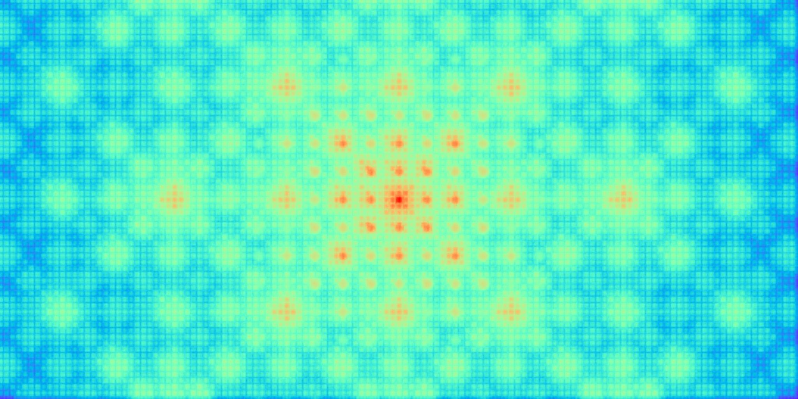
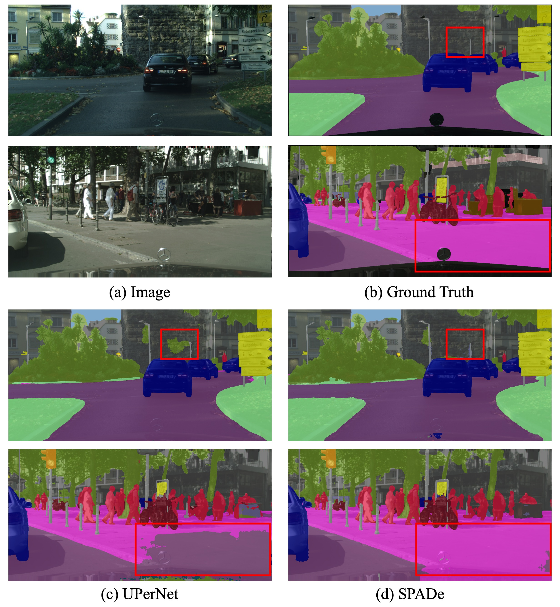

# Spatial Plaid Attention Decoder for Semantic Segmentation (ICIP 2024)
<a href="https://scholar.google.com/citations?user=ChVH78sAAAAJ&hl=en">Abolfazl Meyarian</a> , 
<a href="https://scholar.google.com/citations?user=4F2la7sAAAAJ&hl=en">Xiaohui Yuan</a> ,
<a href="https://scholar.google.com/citations?user=LyQTsQcAAAAJ&hl=en">Zhinan Qiao</a> <br/>
[[`IEEE ICIP`](https://ieeexplore.ieee.org/abstract/document/10648129)] [[`BibTeX`](#CitingSPADe)]

<div align="center">
  
</div><br/>

### Features
SPADe achieves the same high performance as most popular state-of-the-art decoders using only 4M parameters. This is particularly beneficial when working with large backbones or limited resources.

Our SPADe has a receptive field similar to the pRF of human vision, telling of its capability to deal with objects of different scales and visibility rates. An average receptive field of SPADe over 100 validation images is visualized below:
<div align="center">
  
</div><br/>

We have also provided a comparison of SPADe with UPerNet on Cityscapes val.:

<div align="center">
  
</div><br/>


## Installation

The SPADe is developed within the MMSegmentation framework from OpenMMLab. To use SPADe, you can either integrate this implementation into your project as a single model class or embed it into the decoders implemented by MMSegmentation. The implementation is provided in a single file for your convenience.
The detailed specifications of the modules and libraries used in our implementations are as follows:

<table border="1">
  <tr>
    <th>Library</th>
    <th>Version</th>
  </tr>
  <tr>
    <td>torch</td>
    <td>2.0.1</td>
  </tr>
  <tr>
    <td>torchvision</td>
    <td>0.15.2</td>
  </tr>
  <tr>
    <td>mmcv</td>
    <td>2.0.0</td>
  </tr>
  <tr>
    <td>mmdet</td>
    <td>3.3.0</td>
  </tr>
  <tr>
    <td>mmengine</td>
    <td>0.10.3</td>
  </tr>
  <tr>
    <td>mmpretrain</td>
    <td>1.2.0</td>
  </tr>
  <tr>
    <td>mmsegmentation</td>
    <td>1.2.2</td>
  </tr>
</table>

## <a name="CitingSPADe"></a>Citing SPADe

Please use the following BibTeX entry to cite SPADe if you used it in your research:

```BibTeX
@inproceedings{meyarian2024spatial,
  title={Spatial Plaid Attention Decoder for Semantic Segmentation},
  author={Meyarian, Abolfazl and Yuan, Xiaohui and Qiao, Zhinan},
  booktitle={2024 IEEE International Conference on Image Processing (ICIP)},
  pages={2723--2729},
  year={2024},
  organization={IEEE}
}
```
